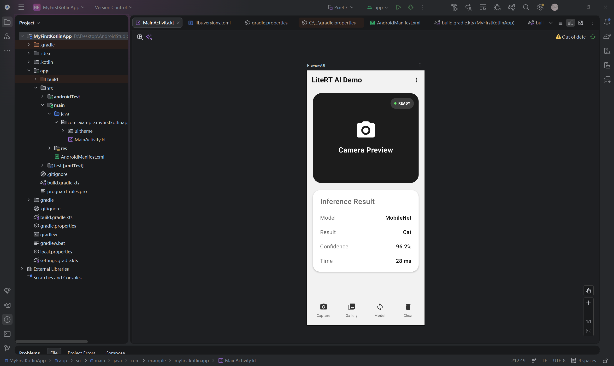

# EReports
##121052023021
---
##assignment of E1 22/4

---
##the first assignment of E2 29/4

---
##the second assignment of E2 6/5
###part1 screenshot

###part2 screenshot

---
###part3 screenshot

---
